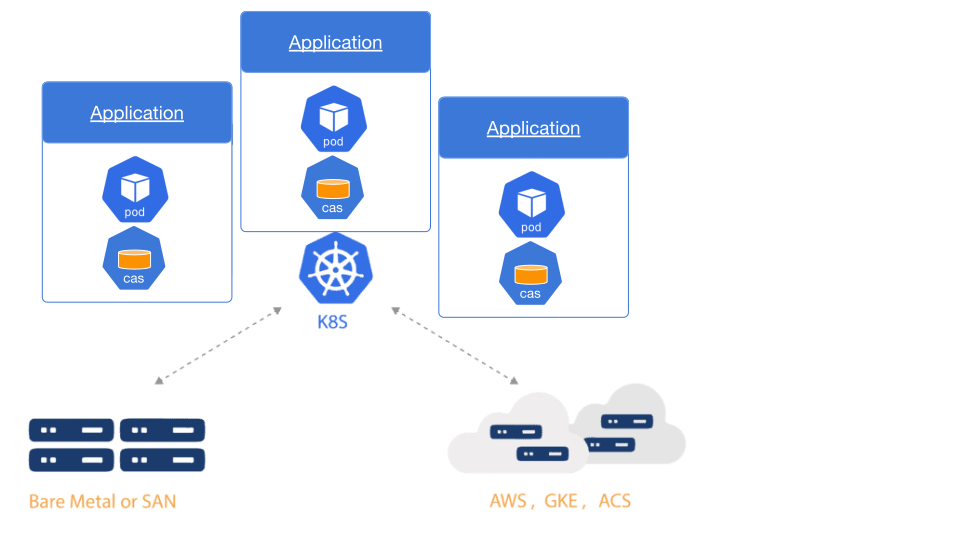

## What is CAS?

Container Attached Storage(CAS) is a software that includes microservice based storage controllers that are orchestrated by Kubernetes.  These storage controllers can run anywhere that Kubernetes can run which means any cloud or even bare metal servers or on top of a traditional shared storage system. Critically, the data itself is also accessed via containers as opposed to being stored in an off platform shared scale out storage system.

CAS is a pattern very much in line with the trend towards disaggregated data and the rise of small, autonomous teams running small, loosely coupled workloads.  In other words, my team might need Postgres for our microservice, and yours might depend on Redis and MongoDB. Some of our use cases might require performance, some might be gone in 20 minutes, others are write intensive, others read intensive, and so on. In a large organization, the technology that teams depend on will vary more and more as the size of the organization grows and as organizations increasingly trust teams to select their own tools.

CAS means that developers can work without worrying about the underlying requirements of their organizations' storage architecture. To CAS, a cloud disk is the same as a SAN which is the same as bare metal or virtualized hosts.  Developers and Platform SREs don’t have meetings to select the next storage vendor or to argue for settings to support their use case, Developers can spin their own CAS containers with whatever storage is available to the Kubernetes clusters.

CAS reflects a broader trend of solutions – many of which are now part of Cloud Native Foundation – that reinvent particular categories or create new ones – by being built on Kubernetes and microservice and that deliver capabilities to Kubernetes based microservice environments. For example, new projects for security, DNS, networking, network policy management, messaging, tracing, logging and more have emerged in the cloud-native ecosystem and often in CNCF itself.

## Advantages of CAS

### Agility

Each storage volume in CAS has a containerized storage controller and corresponding containerized replicas. Hence, maintenance and tuning of the resources around these components are truly agile. The Kubernetes rolling upgrades capability enables seamless upgrades of storage controller and  storage replicas. Resources such as CPU and memory can be tuned using container cGroups. 

### Granularity of Storage Policies

Containerizing the storage software and dedicating the storage controller to each volume brings maximum granularity in storage policies. With CAS architecture, you can configure all storage policies on a per-volume basis. In addition, you can monitor storage parameters of every volume and dynamically update storage policies to achieve the desired result for each workload. The control of storage throughput, IOPS, and latency increases with this additional level of granularity in the volume storage policies.

### Avoids Lock-in

Avoiding cloud vendor lock-in is the common goal for most users and enterprises. This goal has contributed significantly to the adoption of Kubernetes as it is a widely accepted orchestration platform for containers. However, the data of stateful applications remains dependent on the cloud provider and technology. With CAS approach, storage controllers can migrate the data in the background and live migration becomes a fairly simple task. In other words, stateful workloads can be moved from one Kubernetes cluster to another in a non-disruptive way for users.

### Cloud Native

CAS containerizes the storage software and uses Kubernetes Custom Resource Definitions (CRDs) to represent the low-level storage resources, such as disks and storage pools. This model enables storage to be integrated into other cloud-native tools seamlessly. The storage resources can be provisioned, monitored, managed using cloud-native tools such as Prometheus, Grafana, Fluentd, Weavescope, Jaeger, and others.

Similar to hyperconverged systems, storage and performance of a volume in CAS are scalable. As each volume is having it's own storage controller, the storage can scale up within the permissible limits of a storage capacity of a node. As the number of container applications increases in a given Kubernetes cluster, more nodes are added, which increases the overall availability of storage capacity and performance, thereby making the storage available to the new application containers. This process is exactly similar to the successful hyperconverged systems like Nutanix. 

### Lower blast radius

CAS architecture does not follow a typical distributed storage architecture that ends up having a higher blast radius when nodes fail or rebuild is in progress. 

With synchronous replication from storage controller onto the fixed storage replicas, the storage becomes highly available. The metadata required to maintain the replicas is simplified to saving the information of the nodes that have replicas and information about the status of replicas to help with quorum. If a node fails, the storage controller, which is a stateless container in this case, is spun on a node where second or third replica is running and data continues to be available. Hence, with CAS there the blast radius is much lower and also localized to the volumes that have replicas on that node. 

## See Also:

[OpenEBS Architecture](/docs/next/architecture.html) [Blog: Container Attached Storage is Cloud Native Storage (CAS)](https://www.cncf.io/blog/2020/09/22/container-attached-storage-is-cloud-native-storage-cas/) [Blog: Container Attached Storage](https://www.cncf.io/blog/2018/04/19/container-attached-storage-a-primer/) [Webinar: Need for Container Attached Storage](https://www.cncf.io/webinars/kubernetes-for-storage-an-overview/) [Connect with Community](/docs/next/support.html)
