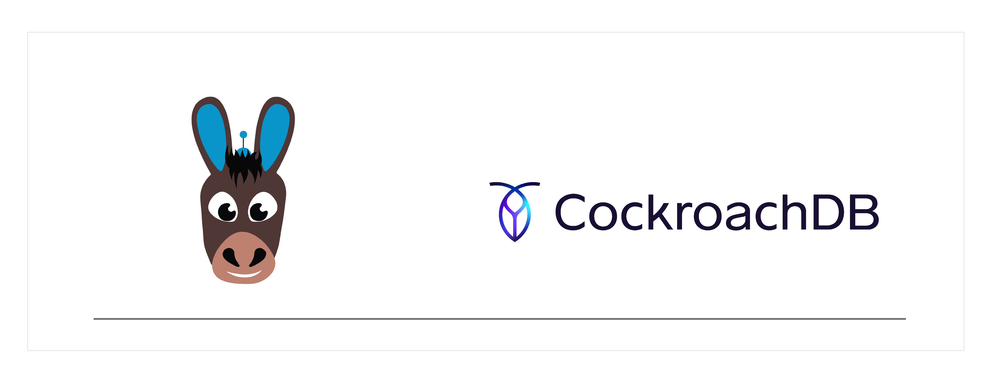

## Introduction

CockroachDB is a cloud-native SQL database for building global, scalable cloud services that survive disasters. It is a distributed SQL database built on a transactional and strongly consistent key-value store. It scales horizontally; survives disk, machine, rack, and even data center failures with minimal latency disruption and no manual intervention; supports strongly consistent ACID transactions; and provides a familiar SQL API for structuring, manipulating, and querying data.

This guide explains the basic installation for CockroachDB operators on OpenEBS Local PV devices.

## Deployment model 

[](../assets/Local-PV-Distributed-device-cockroachdb.svg)

The Local PV volume will be provisioned on a node where CockroachDB pods are getting scheduled and uses one of the matching unclaimed block devices for each of them, which will then use the entire block device for storing data. No other application can use this device. If users have limited block devices attached to some nodes, they can use `nodeSelector` in the application YAML to provision applications on particular nodes where the available block device is present. The recommended configuration is to have at least three nodes and one unclaimed external disk to be attached per node.

## Configuration workflow 

1. [Install OpenEBS](#install-openebs)
2. [Select OpenEBS storage engine](#select-openebs-storage-engine) 
3. [Configure OpenEBS Local PV StorageClass](#configure-openebs-local-pv-storageclass) 
4. [Install CockroachDB Operator](#install-cockroachdb-operator)
5. [Accessing CockroachDB](#accessing-cockroachdb)

### Install OpenEBS

If OpenEBS is not installed in your K8s cluster, this can be done from [here](/docs/user-guides/installation). If OpenEBS is already installed, go to the next step.

### Select OpenEBS storage engine

A storage engine is the data plane component of the IO path of a Persistent Volume. In CAS architecture, users can choose different data planes for different application workloads based on a configuration policy. OpenEBS provides different types of storage engines and you should choose the right engine that suits your application requirements and storage available on your Kubernetes nodes. For more information you can read [here](/).

After OpenEBS installation, choose the OpenEBS storage engine as per your requirement. 

- Choose **cStor**, If you are looking for replicated storage features and other enterprise graded features such as volume expansion, backup and restore, etc.

- Choose **OpenEBS Local PV**, If you are looking for direct-attached storage or low latency data write or if the application manages data replication.

In this document, we are deploying CockroachDB using OpenEBS Local PV. 

### Configure OpenEBS Local PV StorageClass

Depending on the type of storage attached to your Kubernetes worker nodes, you can select from different flavors of Dynamic Local PV - Hostpath, Device, LVM, ZFS, or Rawfile. For more information, you can read [here](/docs/concepts/localpv).

The Storage Class `openebs-device` will be used to deploy CockroachDB in the Kubernetes cluster.

**Note:** Ensure that you have at least one disk with the required capacity added to the corresponding nodes before CockroachDB installation. In this example, we have added one 100GB disk to each node.

### Install CockroachDB Operator

- Install the CRD using the following command.

  ```bash
  kubectl apply -f https://raw.githubusercontent.com/cockroachdb/cockroach-operator/master/config/crd/bases/crdb.cockroachlabs.com_crdbclusters.yaml
  ```

  ```bash hideCopy
  #sample output
  customresourcedefinition.apiextensions.k8s.io/crdbclusters.crdb.cockroachlabs.com created
  ```
 
  **Note:** On GKE, additional RBAC policy of cluster-admin is required. Use the following command to create it.

  ```bash
  kubectl create clusterrolebinding $USER-cluster-admin-binding \
  --clusterrole=cluster-admin \
  --user=<google-cloud-user-account>
  ```

  You can obtain the Google cloud user account by using the following command 

  ```bash
  gcloud info | grep Account
  Account: [username@mayadata.io]
  ```

  ```bash hideCopy
  #sample output
  clusterrolebinding.rbac.authorization.k8s.io/k8s-cluster-admin-binding created
  ``` 

- Deploy the cockroachdb operator using the following command

  ```bash
  kubectl apply -f https://raw.githubusercontent.com/cockroachdb/cockroach-operator/master/manifests/operator.yaml
  ```

  ```bash hideCopy
  #sample output
  clusterrole.rbac.authorization.k8s.io/cockroach-database-role created
  serviceaccount/cockroach-database-sa created
  clusterrolebinding.rbac.authorization.k8s.io/cockroach-database-rolebinding created
  role.rbac.authorization.k8s.io/cockroach-operator-role created
  clusterrolebinding.rbac.authorization.k8s.io/cockroach-operator-rolebinding created
  clusterrole.rbac.authorization.k8s.io/cockroach-operator-role created
  serviceaccount/cockroach-operator-sa created
  rolebinding.rbac.authorization.k8s.io/cockroach-operator-default created
  deployment.apps/cockroach-operator created
  ```

- Check Operator deployment pod status

  ```bash
  kubectl get pods
  ```

  ```bash hideCopy
  #sample out
  NAME                                  READY   STATUS    RESTARTS   AGE
  cockroach-operator-599465988d-k6ffx   1/1     Running   0          48s
  ```

#### Deploying CockroachDB cluster

- Download the cluster configuration file and make the necessary changes as per your requirement.

  ```bash
  curl -O https://raw.githubusercontent.com/cockroachdb/cockroach-operator/master/examples/example.yaml
  ```

  We will update the storage class to use `openebs-device`, as shown below. Please note that for the production environment, make necessary other changes as per your requirement.

  Sample `example.yaml` changes

  ```bash
  ---
  apiVersion: crdb.cockroachlabs.com/v1alpha1
  kind: CrdbCluster
  metadata:
    name: cockroachdb
  spec:
    dataStore:
      pvc:
        spec:
          accessModes:
            - ReadWriteOnce
          resources:
            requests:
              storage: "60Gi"
          volumeMode: Filesystem
          storageClassName: openebs-device
     tlsEnabled: true
     image:
      name: cockroachdb/cockroach:v20.2.5
    nodes: 3
  ```

- Apply the cluster configuration file

  ```bash
  kubectl apply -f example.yaml
  ```

### Verify CockroachDB is up and running
  
- Get the CockroachDB Pods, StatefulSet, Service, and PVC details. It should show that StatefulSet is deployed with 3 cockroach pods in a running state. 

  ```bash
  kubectl get pod,pv,pvc,sc
  ```

  ```bash hideCopy
  #sample output
  NAME                                      READY   STATUS    RESTARTS   AGE
  pod/cockroach-operator-599465988d-fkgv6   1/1     Running   0          5m20s
  pod/cockroachdb-0                         1/1     Running   0          2m17s
  pod/cockroachdb-1                         1/1     Running   0          110s
  pod/cockroachdb-2                         1/1     Running   0          81s
  
  NAME                                                        CAPACITY   ACCESS MODES   RECLAIM POLICY   STATUS   CLAIM                           STORAGECLASS     REASON   AGE
  persistentvolume/pvc-6f0a99a2-504a-4ab7-b865-200f96bfc6cb   60Gi       RWO            Delete           Bound    default/datadir-cockroachdb-1   openebs-device            104s
  persistentvolume/pvc-a71b5078-f56f-4e1f-9237-43cfd854195e   60Gi       RWO            Delete           Bound    default/datadir-cockroachdb-0   openebs-device            2m12s
  persistentvolume/pvc-de6ec858-0106-4454-8190-66cd2a9b465f   60Gi       RWO            Delete           Bound    default/datadir-cockroachdb-2   openebs-device            76s
  
  NAME                                          STATUS   VOLUME                                     CAPACITY   ACCESS MODES   STORAGECLASS     AGE
  persistentvolumeclaim/datadir-cockroachdb-0   Bound    pvc-a71b5078-f56f-4e1f-9237-43cfd854195e   60Gi       RWO            openebs-device   2m19s
  persistentvolumeclaim/datadir-cockroachdb-1   Bound    pvc-6f0a99a2-504a-4ab7-b865-200f96bfc6cb   60Gi       RWO            openebs-device   111s
  persistentvolumeclaim/datadir-cockroachdb-2   Bound    pvc-de6ec858-0106-4454-8190-66cd2a9b465f   60Gi       RWO            openebs-device   82s
  
  NAME                                                    PROVISIONER                                                RECLAIMPOLICY   VOLUMEBINDINGMODE      ALLOWVOLUMEEXPANSION   AGE
  storageclass.storage.k8s.io/openebs-device              openebs.io/local                                           Delete          WaitForFirstConsumer   false                  25m
  storageclass.storage.k8s.io/openebs-hostpath            openebs.io/local                                           Delete          WaitForFirstConsumer   false                  25m
  storageclass.storage.k8s.io/openebs-jiva-default        openebs.io/provisioner-iscsi                               Delete          Immediate              false                  25m
  storageclass.storage.k8s.io/openebs-snapshot-promoter   volumesnapshot.external-storage.k8s.io/snapshot-promoter   Delete          Immediate              false                  25m
  storageclass.storage.k8s.io/premium-rwo                 pd.csi.storage.gke.io                                      Delete          WaitForFirstConsumer   true                   38m
  storageclass.storage.k8s.io/standard (default)          kubernetes.io/gce-pd                                       Delete          Immediate              true                   38m
  storageclass.storage.k8s.io/standard-rwo                pd.csi.storage.gke.io                                      Delete          WaitForFirstConsumer   true                   38m
  ```

#### Accessing CockroachDB

- We will be using the built-in sql-client for accessing and running some sql queries. Enter into one of the cockroachdb pods by using the exec command.

  ```bash
  kubectl exec -it cockroachdb-2 -- ./cockroach sql --certs-dir cockroach-certs
  ```

  ```bash hideCopy
  #sample output
  #
  # Welcome to the CockroachDB SQL shell.
  # All statements must be terminated by a semicolon.
  # To exit, type: \q.
  #
  # Server version: CockroachDB CCL v20.2.5 (x86_64-unknown-linux-gnu, built 2021/02/16 12:52:58, go1.13.14) (same version as client)
  # Cluster ID: e51bfde5-2e75-4991-844e-d769f4b9b684
  #
  # Enter \? for a brief introduction.
  #
  root@:26257/defaultdb>
  ```

- Run some basic SQL queries.
  Example command:

  ```bash
  root@:26257/defaultdb> CREATE DATABASE bank;
  root@:26257/defaultdb> CREATE TABLE bank.accounts (id INT PRIMARY KEY, balance DECIMAL);
  root@:26257/defaultdb> INSERT INTO bank.accounts VALUES (1, 1000.50);
  root@:26257/defaultdb> SELECT * FROM bank.accounts;
    id | balance
  -----+----------
     1 | 1000.50
  (1 row)
  ```

- Create a database user with a password for accessing the database using web UI.

  ```bash
  root@:26257/defaultdb> CREATE USER roach WITH PASSWORD 'Q7gc8rEdS';
  root@:26257/defaultdb> GRANT admin TO roach;
  ```
 
- Create one more database, which will be used later for running benchmark load

  ```bash
  root@:26257/defaultdb> CREATE DATABASE sbtest;
  root@:26257/defaultdb> \q
  ```

#### Accessing the database's web interface. 

We will be using NodePort for accessing the service.
In the production environment either use a load balancer or ingress services as per your requirement

- Create a new node port service using the following YAML spec. The following sample spec is saved as `cockroachdb-public-node-port.yaml`.

  ```bash 
  apiVersion: v1
  kind: Service
  metadata:
    name: cockroachdb-public-nodeport
    namespace: default
  spec:
    ports:
    - name: grpc
      port: 26257
      protocol: TCP
      targetPort: 26257
    - name: http
      port: 8080
      protocol: TCP
      targetPort: 8080
    selector:
      app.kubernetes.io/component: database
      app.kubernetes.io/instance: cockroachdb
      app.kubernetes.io/name: cockroachdb
    sessionAffinity: None
    type: NodePort
  ```

  ```bash
  kubectl apply -f cockroachdb-public-node-port.yaml
  ```

- Get the service details

  ```bash
  kubectl get svc
  ```

  ```bash hideCopy
  #sample output
  NAME                          TYPE        CLUSTER-IP    EXTERNAL-IP   PORT(S)                          AGE
  cockroachdb                   ClusterIP   None          <none>        26257/TCP,8080/TCP               6m57s
  cockroachdb-public            ClusterIP   10.68.5.179   <none>        26257/TCP,8080/TCP               6m57s
  cockroachdb-public-nodeport   NodePort    10.68.4.195   <none>        26257:30324/TCP,8080:31937/TCP   5s
  kubernetes                    ClusterIP   10.68.0.1     <none>        443/TCP                          43m
  ```

- Verify that the cockroachDB Dashboard is accessible using web interface

  ```bash
  https://<any_node_external-ip>:<NodePort>
  ```

  Login credentials for the web UI
  Username: `roach`
  Password: `Q7gc8rEdS`

## See Also:

[OpenEBS architecture](/docs/concepts/architecture) [OpenEBS use cases](/docs/introduction/usecases) [Local PV concepts](/docs/concepts/localpv) [Understanding NDM](/docs/user-guides/ndm)
